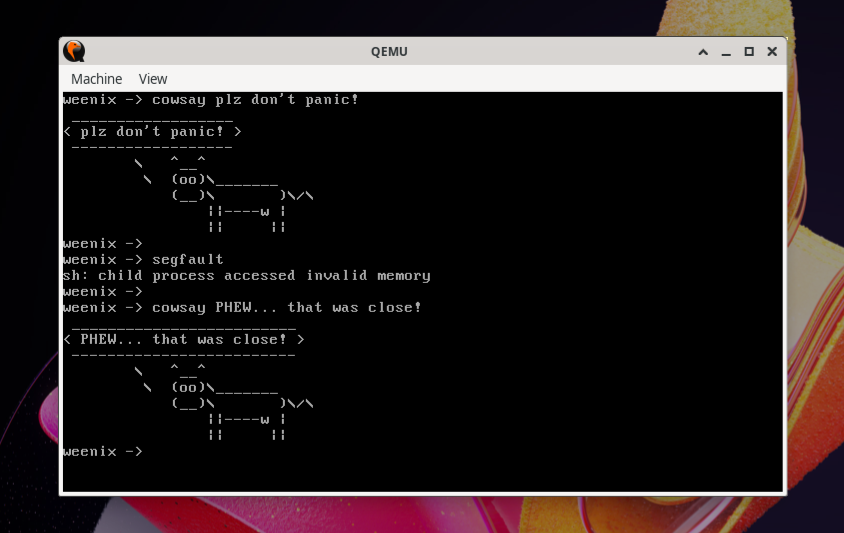
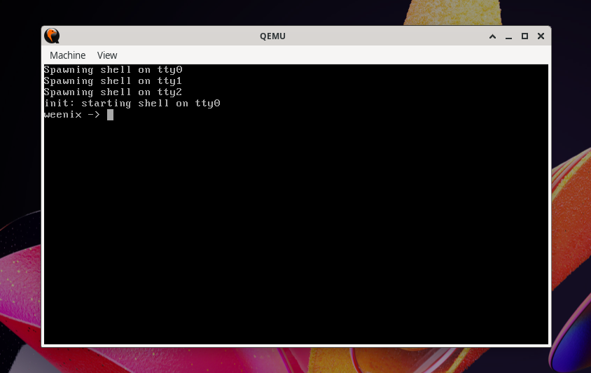

# weenix

A Unix-like operating system kernel, built as a semester-long project for the course [Operating Systems](https://brown-cs1690.github.io/brown-cs167-s23/) (CSCI2670) at Brown University. Check out [this](https://github.com/brown-cs1690/handout/wiki) Wiki page if you'd like to know more about Weenix (and other course assignments.)

Major components of the kernel that I implemented (~6K lines of code) include:
- **Proc:** Kernel threads, context switching, processes, and synchronization primitives;
- **Drivers:** Device drivers for virtual terminals (`tty`), disks, and memory devices (`/dev/null`, `/dev/zero`);
- **FS:** Virtual file system (VFS) and System V file system (S5FS);
- **VM:** Virtual memory management that supports file-backed and anonymous memory mapping, copy-on-write fork with shadow memory objects, and page fault handling.

To respect Brown's [Academic Code](https://college.brown.edu/sites/default/files/2022-04/Academic-Code.pdf), this repo only serves as a placeholder and does not contain the actual implementation of the kernel. Please reach out to me if you wish to look at the code. (Provided you're not a Brown student who's taking OS, of course.)

## screenshots

